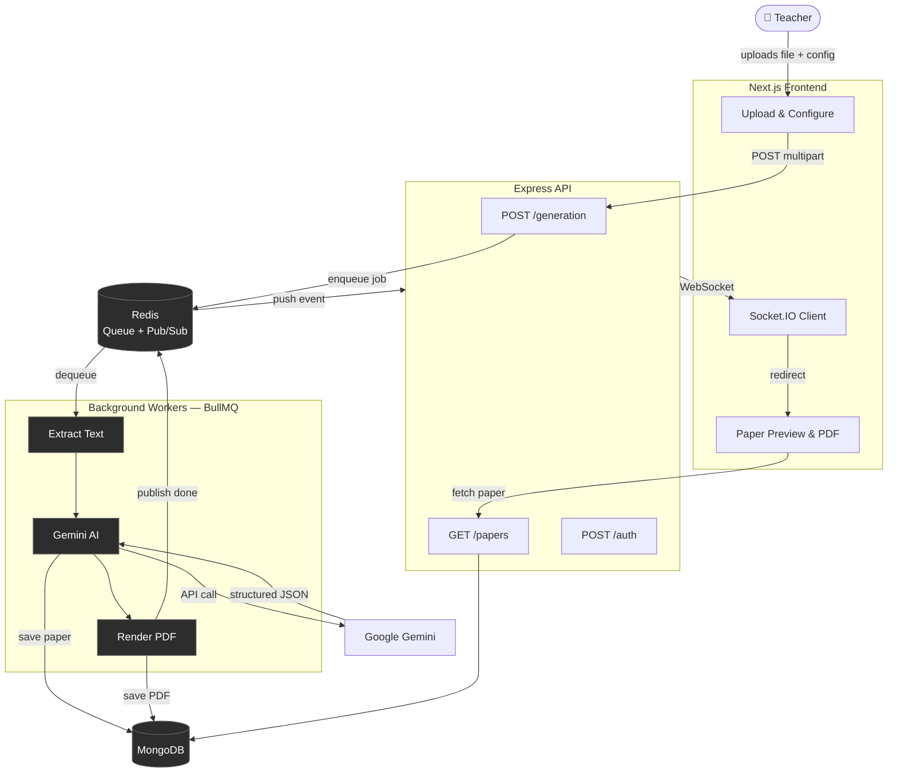
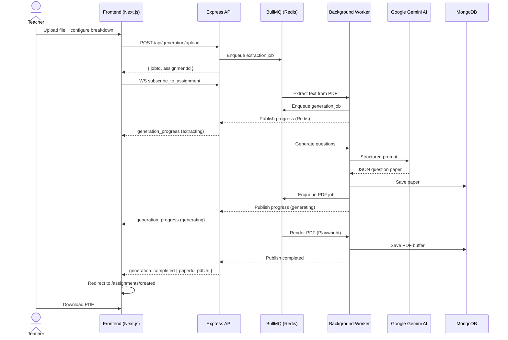

# VedaAI – AI Assessment Creator

> **Hiring Assignment Submission.** This project was built as part of an interview/hiring process for VedaAI. The task was to design and implement a full-stack, production-grade AI Assessment Creator from scratch — covering everything from system architecture and background job processing to real-time WebSocket communication and polished PDF export.

The core idea is simple: a teacher uploads their study material (PDF or plain text), defines how they want the question paper structured — how many MCQs, short answers, long answers, how many marks each — and the system takes it from there. Google Gemini processes the content, generates a structured question paper, and renders it into a clean, academic-style PDF, all in the background while the frontend shows live progress.

The implementation is a **monorepo** with a clear separation of concerns — an Express API that stays fast and non-blocking by handing off all heavy work to background workers (BullMQ + Redis), a Next.js frontend that communicates over WebSockets for real-time updates, and a shared package for types and schemas. The stack was chosen to be scalable, production-deployable on free-tier infrastructure, and developer-friendly — with environment-aware storage (local disk in dev, MongoDB in prod) and a Gemini model fallback chain so generation doesn't fail if one model is rate-limited.

---

## Table of Contents

- [Architecture](#architecture)
- [Tech Stack](#tech-stack)
- [Monorepo Structure](#monorepo-structure)
- [Getting Started](#getting-started)
- [Environment Variables](#environment-variables)
- [Running Locally](#running-locally)
- [API Documentation](#api-documentation)
- [Frontend Pages & Routes](#frontend-pages--routes)
- [Real-Time Updates (WebSocket)](#real-time-updates-websocket)
- [Deployment](#deployment)
- [Features](#features)

---

## Architecture

### System Flow



### Request Lifecycle



---

## Tech Stack

| Layer              | Technology                                           |
| ------------------ | ---------------------------------------------------- |
| Frontend Framework | Next.js 14 (App Router) + TypeScript                 |
| Styling            | CSS Modules + CSS Variables                          |
| Runtime            | Node.js + TypeScript                                 |
| API Framework      | Express                                              |
| Database           | MongoDB (Mongoose)                                   |
| Job Queue          | BullMQ (Redis)                                       |
| AI                 | Google Gemini (`generative-ai` SDK)                  |
| PDF Generation     | Handlebars + Playwright (local) / Browserless (prod) |
| File Extraction    | pdf-parse-new                                        |
| Authentication     | bcryptjs + jsonwebtoken                              |
| Realtime           | Socket.IO + Redis Pub/Sub                            |
| Storage (prod)     | MongoDB (GridFS-style Buffers)                       |
| Package Manager    | pnpm                                                 |
| Monorepo Tooling   | pnpm workspaces                                      |

---

## Monorepo Structure

```
question-generator/
├── apps/
│   ├── backend/               # Express API server
│   │   ├── app/
│   │   │   ├── routes/        # auth, generation, papers
│   │   │   ├── models/        # Mongoose schemas
│   │   │   └── socket/        # Socket.IO + Redis pub/sub
│   │   └── index.ts
│   ├── worker/                # Background job processor
│   │   └── jobs/              # extract, generate, pdf workers
│   └── frontend/              # Next.js app
│       ├── app/
│       │   ├── assignments/
│       │   │   ├── create/    # Assignment creation form
│       │   │   └── created/   # Paper preview + PDF download
│       │   ├── layout.tsx
│       │   └── page.tsx       # Dashboard
│       ├── components/
│       │   └── TopBar.tsx
│       └── services/
│           └── assignmentService.ts
├── packages/
│   └── shared/                # Zod schemas, WebSocket types
├── pnpm-workspace.yaml
├── package.json               # Root scripts (dev:all, build)
└── .env
```

---

## Getting Started

### Prerequisites

- Node.js ≥ 18
- pnpm — `npm i -g pnpm`
- MongoDB (local or Atlas URI)
- Redis (local or cloud)
- Google Gemini API key — [get one free](https://aistudio.google.com/app/apikey)
- _(Optional)_ Browserless API key for production PDFs — [browserless.io](https://www.browserless.io/)

### Installation

```bash
# Clone the repo
git clone https://github.com/your-username/question-generator.git
cd question-generator

# Install all dependencies
pnpm install

# Build shared package (required before first run)
pnpm --filter @veda/shared build
```

---

## Environment Variables

Create a `.env` file at the **project root**. All apps load it via `dotenv`.

```env
# Server
PORT=4000
NODE_ENV=development          # or production

# Database
MONGO_URI=mongodb+srv://...

# Redis
REDIS_URI=redis://localhost:6379

# AI
GEMINI_API_KEY=your_key_here
AI_MODEL_TIMEOUT_MS=20000     # optional, per-model timeout

# JWT
JWT_SECRET=your_secret_min_32_chars
JWT_EXPIRES_IN=7d

# Queue
QUEUE_NAME=paper-generation

# PDF (production only)
BROWSERLESS_API_KEY=your_key
```

For the frontend, create `apps/frontend/.env.local`:

```env
NEXT_PUBLIC_API_URL=http://localhost:4000
```

---

## Running Locally

Start the API server, worker, and frontend all at once:

```bash
pnpm dev:all
```

Or individually:

```bash
pnpm --filter @veda/backend dev    # API → http://localhost:4000
pnpm --filter @veda/worker dev     # Background worker
pnpm --filter frontend dev         # Frontend → http://localhost:3000
```

**Health check:** `GET http://localhost:4000/health` → `{"status":"ok"}`

---

## API Documentation

### Authentication

All endpoints accept an optional `Authorization: Bearer <token>` header. Guests can generate papers without signing in; signed-in users get papers linked to their account.

| Method | Endpoint           | Description                 | Auth     |
| ------ | ------------------ | --------------------------- | -------- |
| POST   | `/api/auth/signup` | Create account              | none     |
| POST   | `/api/auth/login`  | Login, returns JWT          | none     |
| GET    | `/api/auth/me`     | Current user + their papers | required |

```bash
# Signup
curl -X POST http://localhost:4000/api/auth/signup \
  -H "Content-Type: application/json" \
  -d '{"name":"Shrey","emailOrPhone":"shrey@meow.edu","institutionName":"Meow Engineering College","password":"mypassword123"}'

# Login
curl -X POST http://localhost:4000/api/auth/login \
  -H "Content-Type: application/json" \
  -d '{"emailOrPhone":"shrey@meow.edu","password":"mypassword123"}'
```

---

### Generation

Two endpoints depending on whether you have a file:

| Method | Endpoint                 | Description              |
| ------ | ------------------------ | ------------------------ |
| POST   | `/api/generation/start`  | JSON-only, no file       |
| POST   | `/api/generation/upload` | Multipart form with file |

**Request fields:**

| Field                    | Type   | Notes                              |
| ------------------------ | ------ | ---------------------------------- |
| `title`                  | string | Subject/title — required           |
| `classLevel`             | string | e.g. "BE 6th Sem"                  |
| `institutionName`        | string | School/college name                |
| `questionBreakdown`      | array  | Preferred — see format below       |
| `totalQuestions`         | number | Used if no breakdown               |
| `marksPerQuestion`       | number | Used if no breakdown               |
| `questionTypes`          | array  | Used if no breakdown               |
| `difficultyPreference`   | enum   | `easy` / `medium` / `hard`         |
| `additionalInstructions` | string | Extra AI instructions              |
| `file`                   | file   | PDF or .txt (upload endpoint only) |

**`questionBreakdown` format:**

```json
[
  { "type": "mcq", "count": 10, "marks": 1 },
  { "type": "short-answer", "count": 5, "marks": 3 }
]
```

Accepted types: `mcq`, `short-answer`, `long-answer`, `true-false`, `fill-blanks`

**JSON-only example:**

```bash
curl -X POST http://localhost:4000/api/generation/start \
  -H "Content-Type: application/json" \
  -d '{
    "title": "Cloud Computing",
    "classLevel": "BE 6th Sem",
    "institutionName": "Meow Engineering College",
    "questionBreakdown": [
      { "type": "mcq", "count": 5, "marks": 1 },
      { "type": "short-answer", "count": 3, "marks": 5 }
    ]
  }'
```

**File upload example:**

```bash
curl -X POST http://localhost:4000/api/generation/upload \
  -F "file=@/path/to/content.pdf" \
  -F "title=Cloud Computing" \
  -F "classLevel=BE 6th Sem" \
  -F "questionBreakdown[0][type]=mcq" \
  -F "questionBreakdown[0][count]=5" \
  -F "questionBreakdown[0][marks]=1" \
  -F "questionBreakdown[1][type]=short-answer" \
  -F "questionBreakdown[1][count]=3" \
  -F "questionBreakdown[1][marks]=5"
```

**Response:** `{ "message": "Generation job created", "jobId": "...", "assignmentId": "..." }`

The `assignmentId` is used to track progress and fetch the final paper.

---

### Papers

| Method | Endpoint                                      | Description                      |
| ------ | --------------------------------------------- | -------------------------------- |
| GET    | `/api/papers/:assignmentId`                   | Fetch generated paper (JSON)     |
| POST   | `/api/papers/:assignmentId/pdf`               | Trigger PDF generation           |
| GET    | `/api/papers/by-assignment/:assignmentId/pdf` | Download PDF (frontend-friendly) |
| GET    | `/api/papers/:paperId/pdf`                    | Serve PDF from DB (production)   |

```bash
# Fetch paper JSON
curl http://localhost:4000/api/papers/6a186c963184ae895c073e7b

# Trigger PDF generation
curl -X POST http://localhost:4000/api/papers/6a186c963184ae895c073e7b/pdf

# Download PDF
curl -J -O http://localhost:4000/api/papers/6a186c9c594164c6efe8bc1a/pdf
```

---

## Frontend Pages & Routes

| Route                              | Description                                                                       |
| ---------------------------------- | --------------------------------------------------------------------------------- |
| `/`                                | Dashboard — lists all assignments, filterable by title                            |
| `/assignments/create`              | Form to configure and upload a new assignment                                     |
| `/assignments/created?paperId=...` | Full paper preview with sections, marks, difficulty, answer key, and PDF download |

### `assignmentService.ts` exports

- `createAssignmentWithFile(formData, file)` — posts multipart form data
- `generatePDF(paperId)` — triggers PDF generation
- Types: `AssignmentFormData`, `QuestionBreakdownItem`, `UploadResponse`

---

## Real-Time Updates (WebSocket)

Connect and subscribe using `socket.io-client`:

```ts
import { io } from "socket.io-client";

const socket = io(process.env.NEXT_PUBLIC_API_URL);
socket.emit("subscribe_to_assignment", assignmentId);
```

**Events:**

| Event                  | Payload                                      | Action                              |
| ---------------------- | -------------------------------------------- | ----------------------------------- |
| `generation_progress`  | `{ stage, message, progress, assignmentId }` | Update progress bar                 |
| `generation_completed` | `{ assignmentId, paperId, paper, pdfUrl }`   | Redirect to preview / auto-download |
| `generation_failed`    | `{ assignmentId, error }`                    | Show error message                  |

---

## Deployment

The app is deployment-ready on **Render** (free tier). The API server and background worker run together via `pnpm run start:combined` using `concurrently`. MongoDB on Atlas, Redis on Render's managed Redis, and PDF generation through Browserless keeps Chromium off the free instance. Files and PDFs are stored as Buffers in MongoDB so there's no disk dependency in production.

---

## Features

- ✅ **AI-powered generation** — Multiple Gemini models with automatic fallback
- ✅ **Custom question breakdown** — Define sections by type, count, and marks
- ✅ **File upload & extraction** — PDF or plain text study material
- ✅ **Real-time progress** — WebSocket updates scoped per assignment
- ✅ **PDF export** — Academic layout with institution name, answer key, MCQ options
- ✅ **User authentication** — JWT signup/login; guest access works too
- ✅ **Background workers** — BullMQ handles all heavy tasks async
- ✅ **Environment-aware storage** — Local disk in dev, MongoDB in production
- ✅ **Scalable monorepo** — Clean separation via pnpm workspaces
